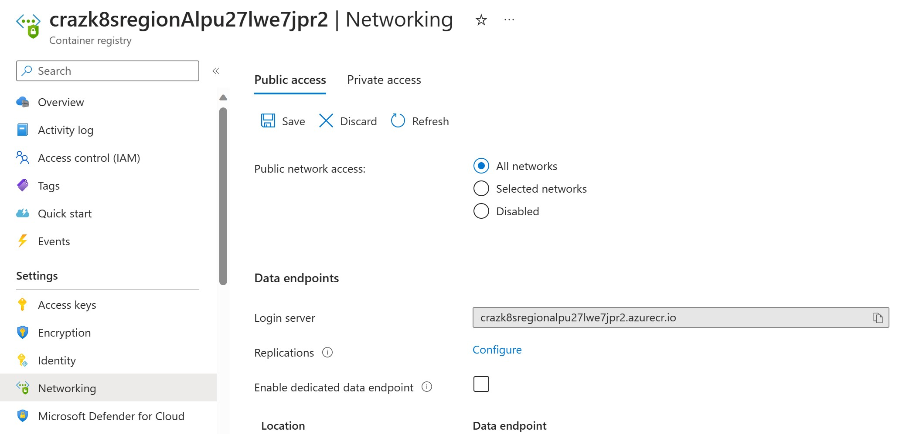
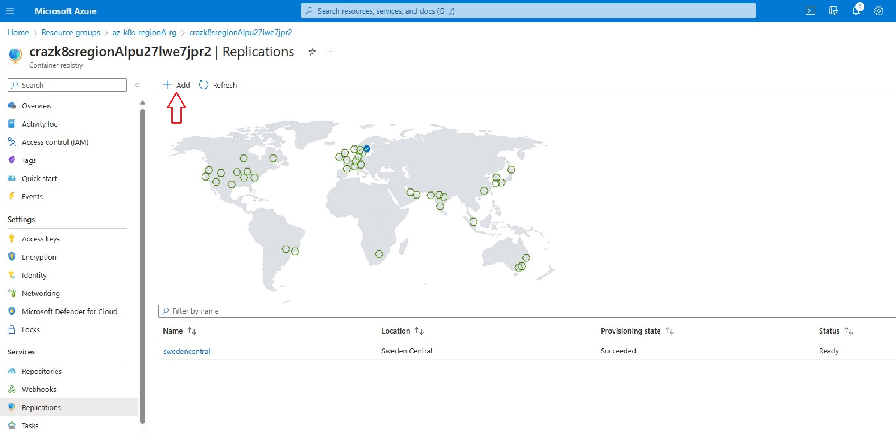

# AKS Multi-Region
The code base in this repository contains a sample solution for establishing a high available AKS cluster in Azure, by using AKS in multiple regions and by directing the traffic with Azure Frontdoor.

## Introduction
By default, AKS provides high availability by using multiple nodes in a Virtual Machine Scale Set (VMSS) that can be distributed across multiple availability zones.  This does not protect agains a region failure however. This tutorial concentrates on how to achieve a higher business continuity with AKS.

# Tutorial

## Prerequisites
#### Recommendation: Use Azure Cloud Shell, as your bash shell. Cloud shell comes pre installed with all the tools needed for this workshop 

If you prefer to use your local environment the following tools are needed:
- Azure CLI.
- Git.
- kubectl client.
- Terraform binary.

## 1. Clone Repository
Clone the repository to cloud shell (or to your local machine - see above)

```git
git clone https://github.com/abengtss-max/aksmultiregion.git
```

## 2. Create Resource Group
```bash
#!/bin/bash
RESOURCE_GROUP_NAME=tfstate

az group create --name $RESOURCE_GROUP_NAME --location swedencentral
``` 

#### Note: In cloud shell, sessions will time out after some time. This means that environment variables will be lost. To work around this, you can save your variables to a file, and then restore them, using the following commands:

```bash
# Save envirnment variables
declare -px > env_vars.txt

# Restore environment variables
source env_vars.txt

```


## 3. Create Azure KeyVault
Lets create an Azure KeyVault for storing our Access key for the storage account that will be created in a later step. 

```bash
KEYVAULT_NAME=keyvault$RANDOM
az keyvault create --name $KEYVAULT_NAME --resource-group $RESOURCE_GROUP_NAME --location "swedencentral"
``` 

## 4. Configure Terraform Backend State
By default, Terraform state is stored locally, which is not secure or ideal. Instead create a storage account to securely store states and access it centrally.

Create storage account.

```bash
#!/bin/bash

STORAGE_ACCOUNT_NAME=tfstate$RANDOM
CONTAINER_NAME=tfstate

# Create storage account
az storage account create --resource-group $RESOURCE_GROUP_NAME --name $STORAGE_ACCOUNT_NAME --sku Standard_LRS --encryption-services blob

# Create blob container
az storage container create --name $CONTAINER_NAME --account-name $STORAGE_ACCOUNT_NAME
```  

Get the storage access key.
```bash
ACCOUNT_KEY=$(az storage account keys list --resource-group $RESOURCE_GROUP_NAME --account-name $STORAGE_ACCOUNT_NAME --query '[0].value' -o tsv)
export ARM_ACCESS_KEY=$ACCOUNT_KEY
``` 

To further protect the storage account access key, store your access keys in the previously created KeyVault. For furher information please visit: https://learn.microsoft.com/en-us/azure/key-vault/secrets/quick-create-cli#add-a-secret-to-key-vault

```bash
az keyvault secret set --vault-name $KEYVAULT_NAME --name "testkey" --value $ACCOUNT_KEY
``` 
Verify that your secrets are stored in your Key vault.

## 5. Update Terraform Template

Update the main.tf file with the correct storage account name ($STORAGE_ACCOUNT_NAME).

## 6. Deploy Infrastructure with Terraform

#### Note: Before doing this step, feel free to take the time to study the terraform template, and the underlying ARM-template (in Assets folder).

Initialize Terraform providers and backend.

```bash
terraform init
``` 

Validate the Terraform configuration.

```bash
terraform validate
```
Deploy the configuration.

```bash 
terraform plan -out plan
terraform apply plan
terraform output
```

## 7. Build and Push application to Azure Container Registry

#### Note: For simplicity we will temporarily open up the Container Registry for public access. This is so that we can continue to use cloud shell, instead of installing all the needed tools on a VM inside the VNET.




Ensure you are in the right directory when you are executing the following command. You should be in the "app" folder.

The command below builds, tags and pushes to image to a container registry called **crazk8sregionAlpu27lwe7jpr2**. Make sure to change to the container registry created (by the terraform script) in your subscription.

```bash 
az acr build --registry crazk8sregionAlpu27lwe7jpr2 --image myapp:v1 .
```

After the container build and push has finished, you can disable public access on the container registry again.

## 8. Deploy the Application to RegionA AKS Private Cluster

As the AKS cluster is private, we need to deploy application either by means of jumphost which is residing in the same vnet or an adjecent vnet which is peered to AKS cluster vnets. In this exercise we will use az aks command invoke which allows administrators to operate securely with AKS without the need of using a jumphost. More information about az aks command invoke can be found here: https://learn.microsoft.com/en-us/azure/aks/command-invoke


```bash 
az aks command invoke   --resource-group az-k8s-region-a-rg   --name aks-az-k8s-region-a   --command 'kubectl apply -f - <<EOF
apiVersion: apps/v1
kind: Deployment
metadata:
  name: latency-test
spec:
  replicas: 1
  selector:
    matchLabels:
      app: latency-test
  template:
    metadata:
      labels:
        app: latency-test
    spec:
      containers:
      - name: latency-test
        image: crazk8sregiona3puht23u7vmqg.azurecr.io/myapp:v1
        ports:
        - containerPort: 8080
---
apiVersion: v1
kind: Service
metadata:
  name: latency-test
  annotations:
    service.beta.kubernetes.io/azure-load-balancer-internal: "true"
spec:
  type: LoadBalancer
  selector:
    app: latency-test
  ports:
  - name: http
    port: 80
    targetPort: 8080
EOF'
```

## 9. ACR Integration with RegionB AKS Private Cluster

Integrate regionB AKS cluster with ACR, note that during the deployment of AKS regionA, a managed identity is already associated to ACR with role AcrPull. This will allow RegionB AKS Cluster to successfully retrieve images onto the Cluster.

```bash 
az aks update -n aks-az-k8s-regionB -g az-k8s-regionB-rg --attach-acr crazk8sregionAlpu27lwe7jpr2
```

## 10. Deploy the Application to RegionB AKS Private Cluster

Deploy the app to RegionB AKS Private Cluster. **Note how long time it takes to deploy the Pod onto the cluster, in comparison to RegionA AKS Cluster** You may encounter that it takes a longer time for the Pod to be in **running state**. This is due to the ACR is currently residing in **swedencentral** and RegionB AKS cluster is situated in **eastus**.

```bash 
az aks command invoke   --resource-group az-k8s-region-b-rg   --name aks-az-k8s-region-b   --command 'kubectl apply -f - <<EOF
apiVersion: apps/v1
kind: Deployment
metadata:
  name: latency-test
spec:
  replicas: 1
  selector:
    matchLabels:
      app: latency-test
  template:
    metadata:
      labels:
        app: latency-test
    spec:
      containers:
      - name: latency-test
        image: crazk8sregiona3puht23u7vmqg.azurecr.io/myapp:v1
        ports:
        - containerPort: 8080
---
apiVersion: v1
kind: Service
metadata:
  name: latency-test
  annotations:
    service.beta.kubernetes.io/azure-load-balancer-internal: "true"
spec:
  type: LoadBalancer
  selector:
    app: latency-test
  ports:
  - name: http
    port: 80
    targetPort: 8080
EOF'
```

## 11.  Enable ACR Geo-Replication
Inorder to reduce the latency, and providing a single point of ACR endpoint for pulling images between different regions, we can enable ACR Geo-Replication. 

Enable Geo-Replication and add eastus as the replication region.



## 12. Deploy the Application to RegionB AKS Private Cluster Again.

Delete the existing running pod in RegionB AKS cluster and redeploy again, note the time difference.

```bash 
az aks command invoke   --resource-group az-k8s-regionB-rg   --name aks-az-k8s-regionB   --command "kubectl run app --image crazk8sregionalpu27lwe7jpr2.azurecr.io/myapp:v1"
```
